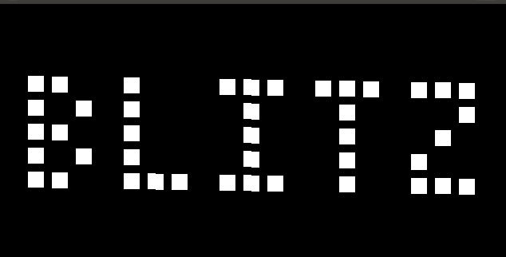

## Chip-8 Emulator

Basic Chip-8 emulator written in Python.

Most python-based Chip-8 emulators are broken up over multiple files for neatness, however I found that this structure made it harder to understand the emulator as a combined whole. I prefer a single-file style, where the program is kept reasonably terse within one single script, so this is how I have implemented the emulator. Hopefully this helps others learning to emulate the Chip-8 system.

Currently it functions for most ROMs but still has significant bugs for others, so YMMV until these are fixed.

### Requirements
* Python 3 (written in `3.7.5`)
* [Pygame](https://www.pygame.org) (written using `1.9.6`)
* Chip-8 ROMs such as those available at [Zophar's Domain](https://www.zophar.net/pdroms/chip8/chip-8-games-pack.html)

### Usage
`chip8_emulator.py` takes a ROM filename as a command line argument, so it's simply `python chip8_emulator.py [romfile]`.

Buttons are:
* 1 2 3 4
* Q W E R
* A S D F

You can alo press `L` to Quit.

### Acknowledgements
* [CowGod's Chip-8 Technical Reference](http://devernay.free.fr/hacks/chip8/C8TECH10.HTM)
* [NerdParadise's intro to Pygame](https://nerdparadise.com/programming/pygame/part1)
* [JoniSuominen's emulator](https://github.com/JoniSuominen/PyCHIP-8) - Another emulator built in the single-file style, I borrowed a few ideas for the drawing/keypad functions from here.
